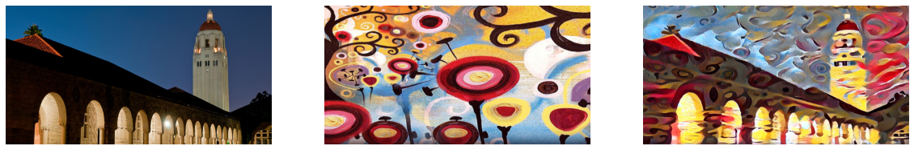

# Neural Style Transfer in Pytorch

*This is an optimization problem based on the paper **[A Neural Algorithm of Artistic Style](https://arxiv.org/abs/1508.06576/)** by Leon A. Gatys, Alexander S. Ecker, and Matthias Bethge.*

    

The paper builds on separating and combining the style and content of natural images. Results seem less appealing as compared to the original work as this code didn't normalize the parameters of the VGG19 network as done in the original work. One more thing that is different from the original work is that it uses maximum pooling layers instead of average pooling layers as suggested in the paper. The original paper also suggested managing L-BFGS for optimal outputs though the code uses Adam optimization for faster calculation.

The optimization-based method presented by Gatys et al. is slow since inference requires
solving an optimization problem. Justin Johnson, Alexandre Alahi, Li Fei-Fei described in their paper **[Perceptual Losses for Real-Time Style Transfer and Super-Resolution](http://cs.stanford.edu/people/jcjohns/eccv16/)** the faster implementation for the same.

The implementation of instance normalization as described in the paper  **[Instance Normalization: The Missing Ingredient](https://arxiv.org/abs/1607.08022/)** for Fast Stylization by Dmitry Ulyanov, Andrea Vedaldi, and Victor Lempitsky further optimized time complexity. This simple trick significantly improves the quality of feedforward style transfer models.